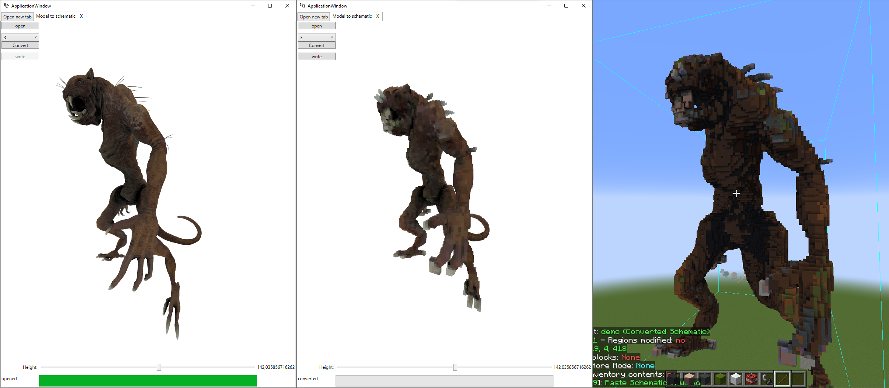
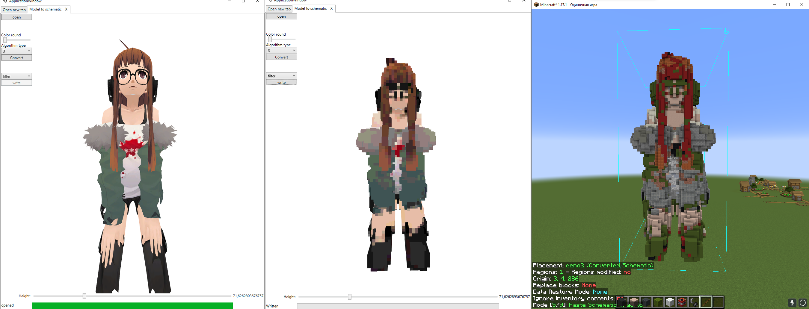
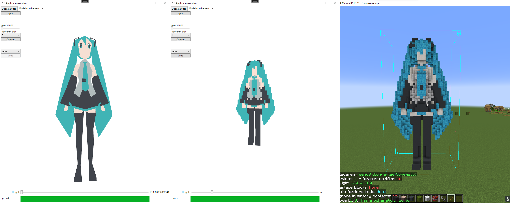
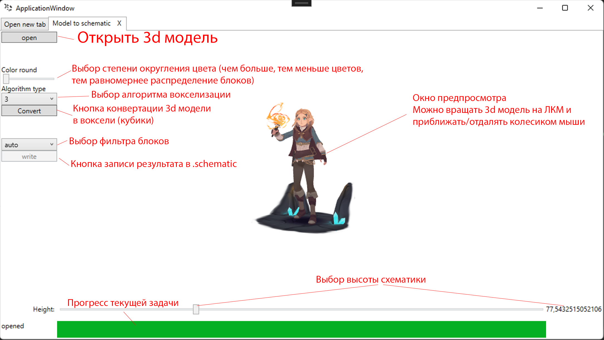

# 3D Mine Tools
3D Mine Tools - это приложение для упрощения творчества в Minecraft. На данный момент реализовано только конвертация 3D модели (.obj; .stl) в формат файлов Schematica (.schematic).

# Примеры работы
Примеры работы программы
 

# Скачать
- [Установите .Net6+](https://dotnet.microsoft.com/en-us/download/dotnet/6.0) (Перейдите по ссылке и скачайте последнюю версию .NET Runtime)
- Скачайте и раcпакуйте последний релиз программы из списка: [Список релизов](https://github.com/OOjeser/3DMineTools/releases)

# Инструкция по применению

- ## Алгоритмы
    - 1 - скорость 0% качество 100% (рекомендуемый для схематик *небольшого* размера)
    - 2 - скорость 100% качество 0%
    - 3 - скорость 90% качество 50% (рекомендуемый для схематик *большого* размера)
    - 3(first) - скорость 95% качество 50% Неестественные переходы между цветами (рекомендуемый для схематик *большого* размера)
- ## Фильтры
    - auto - Использовать все блоки из БД
    - filter - Использовать только выбранные блоки 
    - manual - Выбрать блок для каждого цвета

# Примечания
- Баги
    - Мне известен баг с исчезновением модели при загрузке или конвертации
        - фиксится поворотом модели
    - Мне известен баг с отображением высоты знаком бесконечности
    - Мне известен баг с утечкой памяти
    - Мне известно, что изображения в фильтрах грузятся слишком долго
    - ## Все баги будут постепенно исправляться
- Доработки
    - планируется добавить конвертацию изображения в мапарт
    - *Так же думаю о других функциях*
